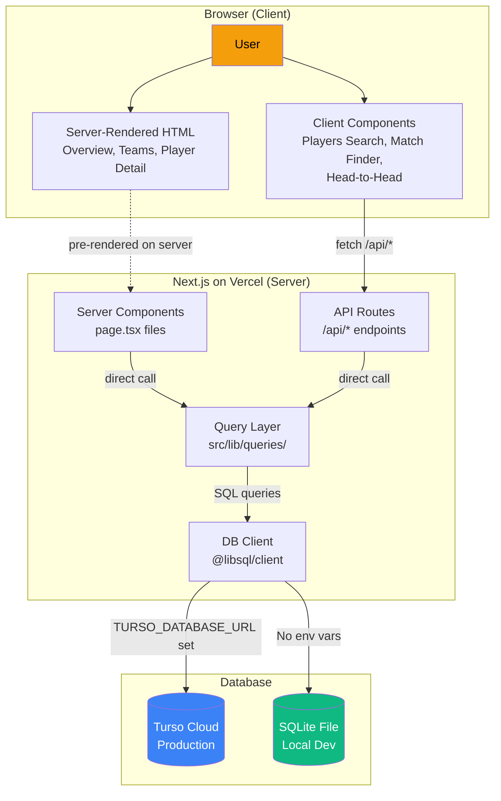
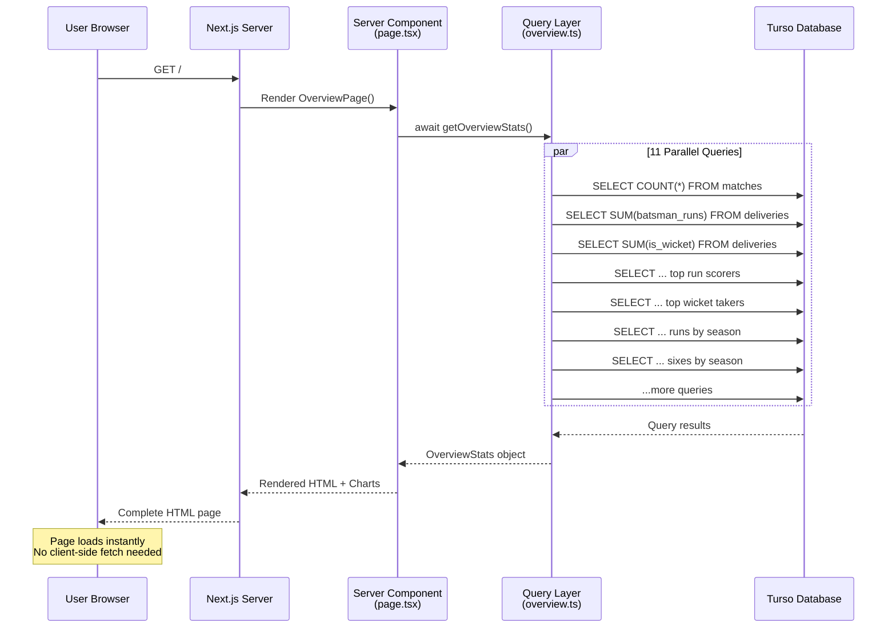
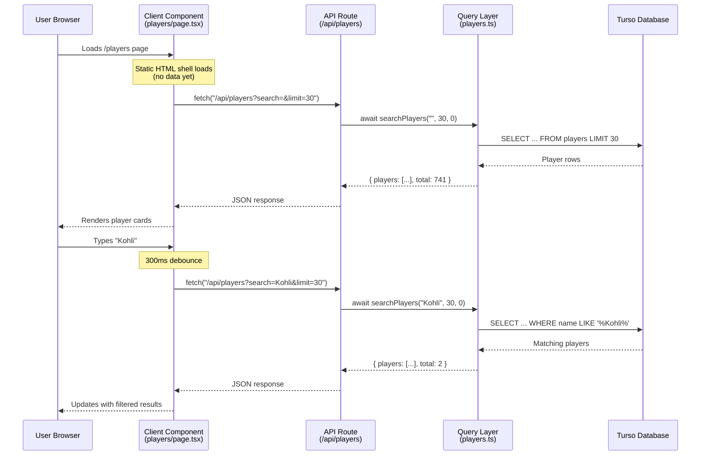
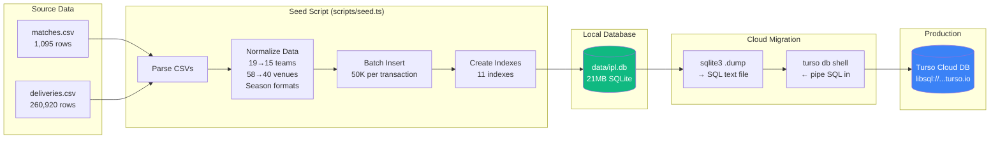
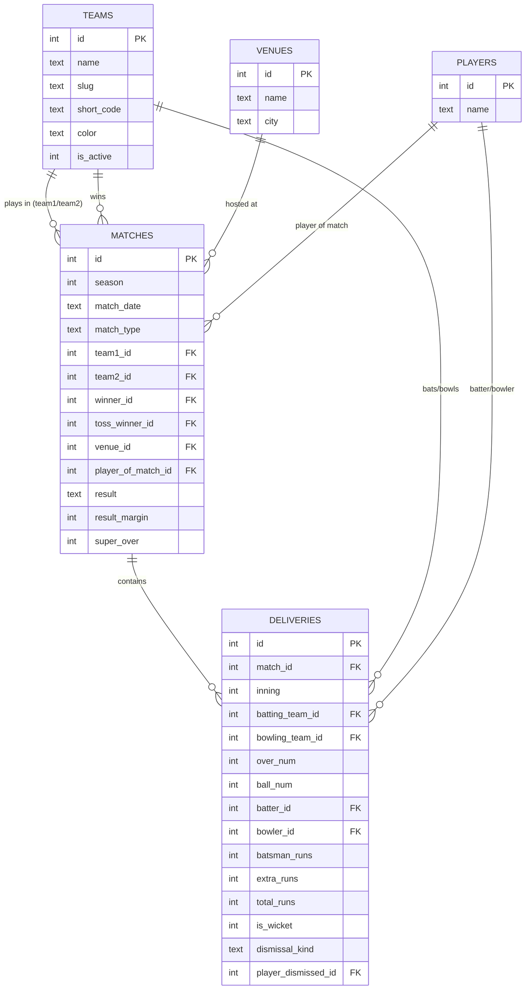
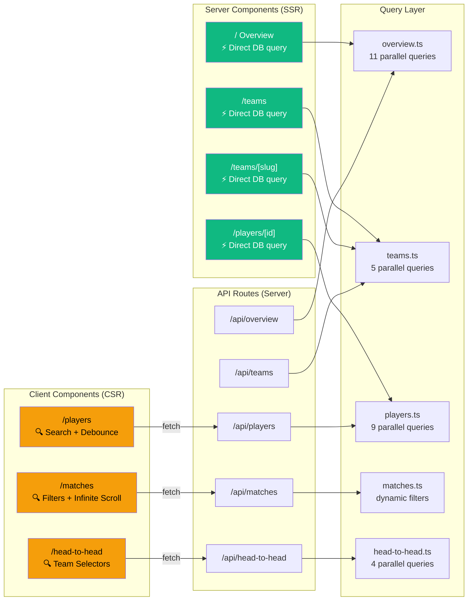
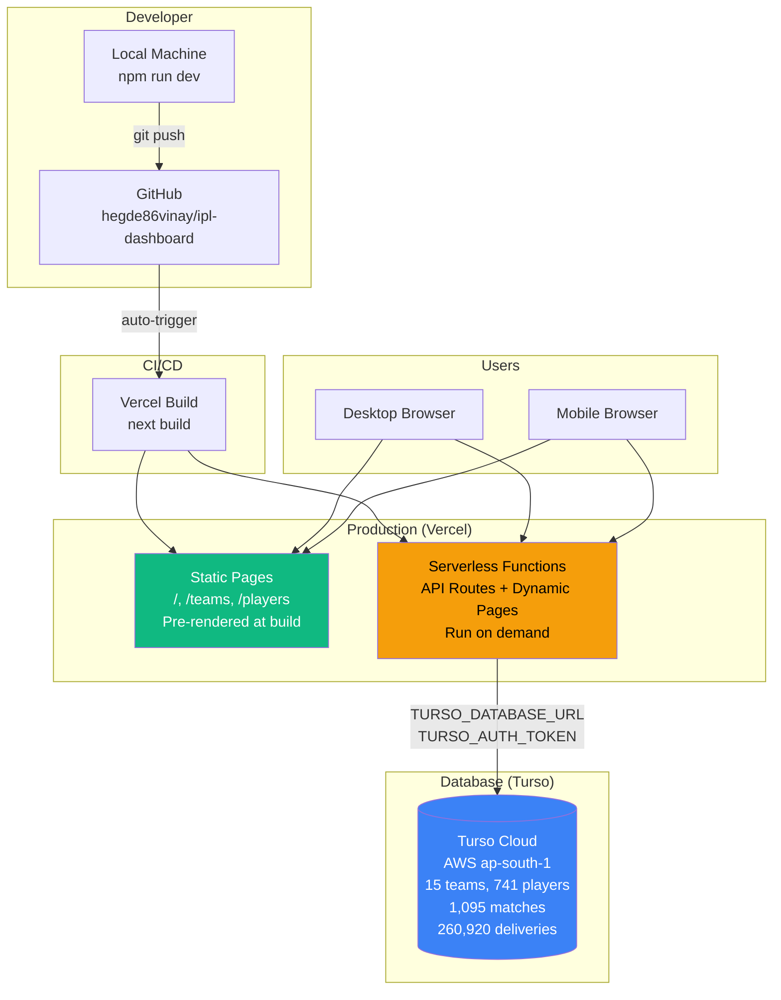

# IPL Dashboard — Architecture Diagrams

## 1. High-Level Architecture

## 2. Request Flow — Server Component (e.g., Overview Page)

## 3. Request Flow — Client Component (e.g., Player Search)

## 4. Data Pipeline — CSV to Production

## 5. Database Schema — Entity Relationships

## 6. Component Architecture — Page Rendering Strategy

## 7. Deployment Architecture

